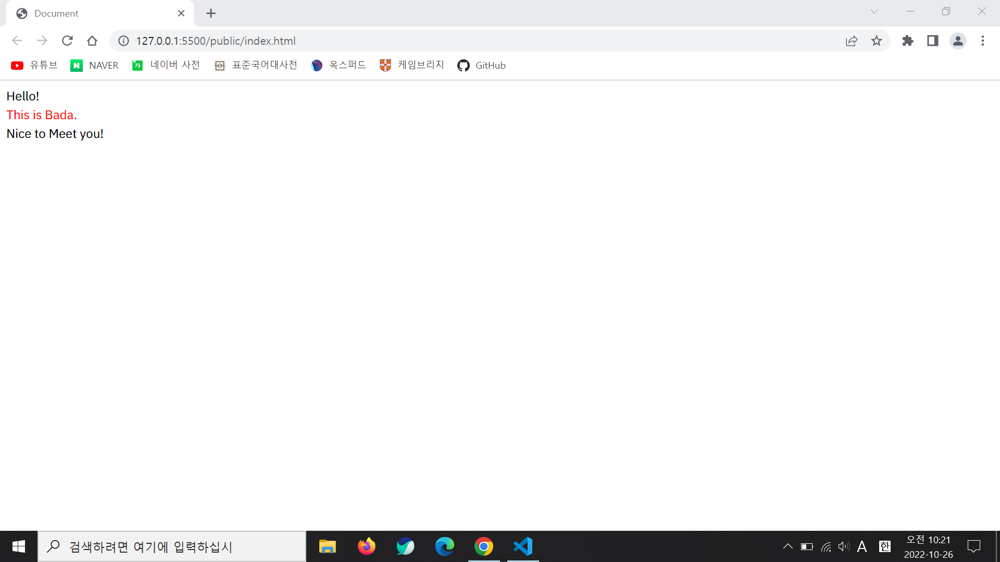

# React without Toolchain

## Introduction

I used React without toolchains such as 'Create React App'.

## Tools

for bundling: webpack

for transpiling React and TypeScript: Babel

## How to Build

Please run this command.

```sh
$ npx webpack
```

After that, please open |public/index.html|.

The result is this.



## Dev Server

I tried to make it, but I failed.

If I run this command,

```sh
$ npx webpack serve
```

1. the browser shows 'Cannot GET /' message

2. get these errors in the console.

```
ERROR in ./node_modules/html-entities/lib/index.js 14:25-54
Module not found: Error: Can't resolve './named-references' in 'E:\깃헙 3670\React-without-toolchain\node_modules\html-entities\lib'
 @ ./node_modules/webpack-dev-server/client/overlay.js 4:0-39 198:26-32
 @ ./node_modules/webpack-dev-server/client/index.js?protocol=ws%3A&hostname=0.0.0.0&port=3000&pathname=%2Fws&logging=info&overlay=true&reconnect=10&hot=true&live-reload=true 13:0-57 139:6-10 197:6-10 206:6-10 237:27-40 254:6-10 271:28-41 288:6-10 302:6-10

ERROR in ./node_modules/html-entities/lib/index.js 15:28-60
Module not found: Error: Can't resolve './numeric-unicode-map' in 'E:\깃헙 3670\React-without-toolchain\node_modules\html-entities\lib'
 @ ./node_modules/webpack-dev-server/client/overlay.js 4:0-39 198:26-32
 @ ./node_modules/webpack-dev-server/client/index.js?protocol=ws%3A&hostname=0.0.0.0&port=3000&pathname=%2Fws&logging=info&overlay=true&reconnect=10&hot=true&live-reload=true 13:0-57 139:6-10 197:6-10 206:6-10 237:27-40 254:6-10 271:28-41 288:6-10 302:6-10

ERROR in ./node_modules/html-entities/lib/index.js 16:24-52
Module not found: Error: Can't resolve './surrogate-pairs' in 'E:\깃헙 3670\React-without-toolchain\node_modules\html-entities\lib'
 @ ./node_modules/webpack-dev-server/client/overlay.js 4:0-39 198:26-32
 @ ./node_modules/webpack-dev-server/client/index.js?protocol=ws%3A&hostname=0.0.0.0&port=3000&pathname=%2Fws&logging=info&overlay=true&reconnect=10&hot=true&live-reload=true 13:0-57 139:6-10 197:6-10 206:6-10 237:27-40 254:6-10 271:28-41 288:6-10 302:6-10

ERROR in ./node_modules/webpack/hot/dev-server.js 11:11-27
Module not found: Error: Can't resolve './log' in 'E:\깃헙 3670\React-without-toolchain\node_modules\webpack\hot'

ERROR in ./node_modules/webpack/hot/dev-server.js 30:4-33
Module not found: Error: Can't resolve './log-apply-result' in 'E:\깃헙 3670\React-without-toolchain\node_modules\webpack\hot'

ERROR in ./node_modules/webpack/hot/dev-server.js 50:18-38
Module not found: Error: Can't resolve './emitter' in 'E:\깃헙 3670\React-without-toolchain\node_modules\webpack\hot'
```

I will really appreciate if you let me know the solution through 'Issues'.
